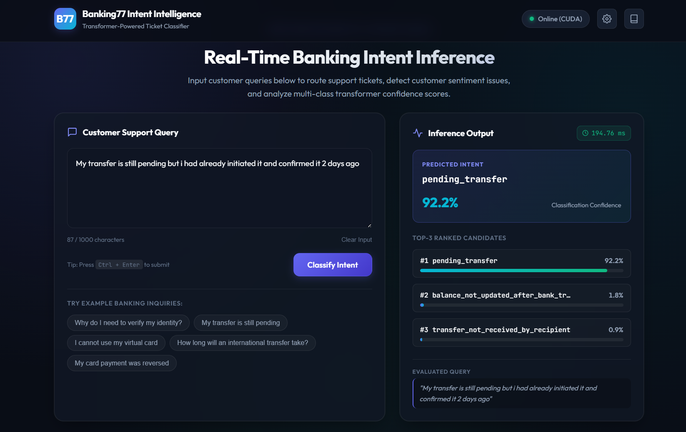
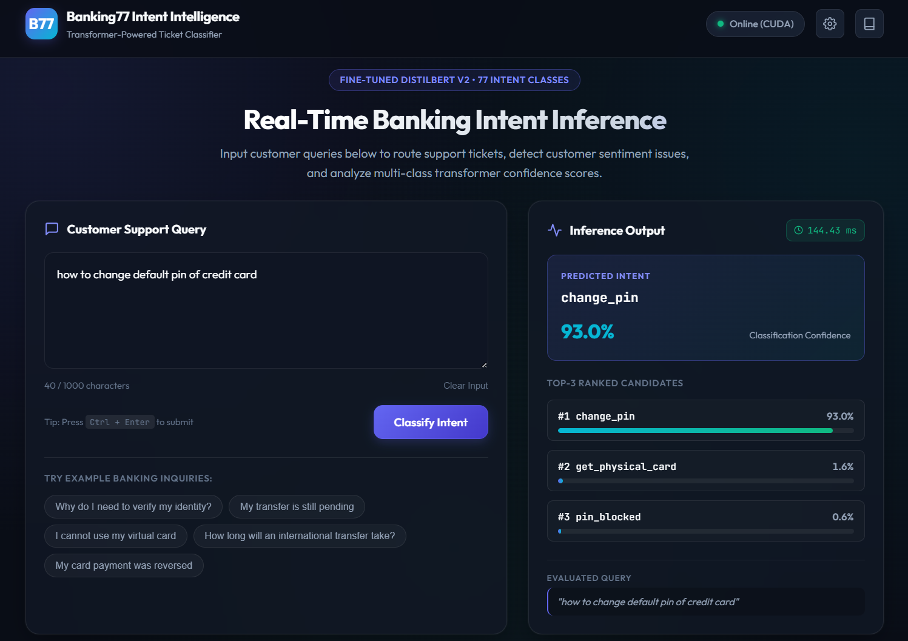
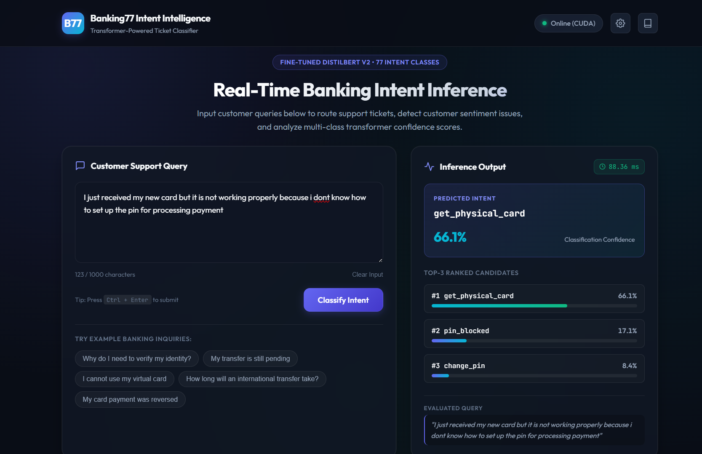

# Banking77 Intent Classifier ; Transformer Inference System

 NLP system for banking customer support intent classification across **77 categories** from the [Banking77](https://huggingface.co/datasets/PolyAI/banking77) benchmark.

Powered by a fine-tuned **DistilBERT** model yielding **0.8907 Validation Macro F1**, using FastAPI inference microservice (~18–20 ms GPU latency), and served with a responsive Web UI.

---

## Key Highlights & Architecture

- **Selected Production Model**: `distilbert-base-uncased` fine-tuned on 77 intent classes.
- **Controlled 3-Way Benchmark**: Rigorously validated against TF-IDF Baseline V1 and BERT-base V3. DistilBERT was selected for production due to achieving 99.7% of BERT's F1 score with **2.6x lower inference latency** and half the parameter footprint.
- **FastAPI Backend**: Lifespan startup handler for single-instance model loading, CUDA kernel pre-warming, inference-only softmax, and `torch.no_grad()` optimization.


---

## 3-Way Model Benchmark Comparison

All experiments used the exact same stratified data split (Train: 8,002 | Validation: 2,001 | Test: 3,080 locked).

| Metric / Attribute | Baseline V1 (TF-IDF + LogReg) | DistilBERT V2 (Selected) | BERT-Base V3 |
| :--- | :--- | :--- | :--- |
| **Architecture** | Word + Char N-Grams + Logistic Regression | `distilbert-base-uncased` (6 layers, 12 heads) | `bert-base-uncased` (12 layers, 12 heads) |
| **Parameter Count** | ~35,000 coefficients | **66.4 Million** | 109.5 Million |
| **Validation Macro F1** | 0.8143 | **0.8907** (+0.0764 vs V1) | 0.8931 (+0.0024 vs V2) |
| **Validation Weighted F1** | 0.8148 | **0.9179** | 0.9197 |
| **Validation Accuracy** | 81.56% | **91.85%** | 92.00% |
| **GPU Inference Latency** | N/A (CPU only) | **~18 &ndash; 20 ms / query** | ~48 &ndash; 52 ms / query |
| **Model Disk Size** | 2.1 MB | **268 MB** (`model.safetensors`) | 438 MB |
| **Decision Rationale** | Strong linear baseline | **Production Selection** &mdash; optimal latency/accuracy tradeoff | Diminishing returns (+0.24% F1 for 2.6x inference cost) |


## Demo Screenshots 
Example-1

Example-2


Example-3 (Inability to classify ticket correctly)

## Getting Started

### 1. Prerequisites & Installation

Ensure you have Python 3.10+ and a virtual environment set up:

```bash
# Clone the repository
git clone https://github.com/I-try-to-code/finance-ticket-classifier-using-transformers--multi-head-attention-.git
cd "finance ticket classifier using transformers (multi head)"

# Install dependencies
pip install -r requirements.txt
```

### 2. Starting the Backend Server

Start the FastAPI application via the built-in runner or Uvicorn:

```bash
# Using the module runner
python -m src.api.main --host 0.0.0.0 --port 8000

# Or directly with Uvicorn
uvicorn src.api.main:app --host 0.0.0.0 --port 8000 --reload
```

Upon startup, the server initializes the predictor, warms up the PyTorch CUDA kernels (if a GPU is detected), and binds to `http://localhost:8000`.

- **Web UI**: [http://localhost:8000/](http://localhost:8000/)
- **Interactive OpenAPI Documentation (Swagger)**: [http://localhost:8000/docs](http://localhost:8000/docs)
- **Service Health Check**: [http://localhost:8000/health](http://localhost:8000/health)

---

## Running the Frontend

### Mode A: Hosted directly by FastAPI (Recommended)
When the FastAPI server starts, it automatically mounts `frontend/` at the root path:
- Open your browser to **`http://localhost:8000`**.
- No additional web server configuration is required.


